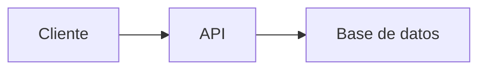

# Trabajo-Relaciones-Humanas
# 📚 Estudio de Roles Básicos en Desarrollo Web y Móvil
## 0) Integrantes del equipo de estudio y sus responsabilidades en el repositorio (*actualizar*)
0. Emerson Jair Paredes Chalco - [eparedescha@unsa.edu.pe](mailto:eparedescha@unsa.edu.pe)
1. Michael Alexander Vasquez Villarreal - [mvasquezvil@unsa.edu.pe](mailto:mvasquezvil@unsa.edu.pe)
2. Luis Gerardo Choquepuma villafuerte
3. Denny Joaquin Mamani Huayhua - [dmamanihuayh@unsa.edu.pe](mailto:dmamanihuayh@unsa.edu.pe)
4. Jazmin Gonzales Ramirez - [jgonzalesra@unsa.edu.pe](mailto:jgonzalesra@unsa.edu.pe)
5. Jonahtan Joaquin Mamani Gutierrez - [jmamanigut@unsa.edu.pe](mailto:jmamanigut@unsa.edu.pe)
6. Rodrigo Enrique Neyra Chambilla
7. Jeanpiere Mamani Nuñez - [jmamaninu@unsa.edu.pe](mailto:jmamaninu@unsa.edu.pe)
8. Ana Pamela Miranda Lopinta - [amirandalo@unsa.edu.pe](mailto:amirandalo@unsa.edu.pe)
9. Franklin Ronald Ulloa Chura - [fulloac@unsa.edu.pe](mailto:fulloac@unsa.edu.pe)
10. Daniel Adriano Gonzales Trelles
11. Matias Hernan Chamana Gonzales - [mchamanag@unsa.edu.pe](mailto:mchamanag@unsa.edu.pe)
12. Jesús Daniel Huertas Illpa - [jhuertasi@unsa.edu.pe](mailto:jhuertasi@unsa.edu.pe)

## 2)Conociendo Git 
Git es un sistema de control de versiones distribuido que permite gestionar cambios en archivos, guardar el historial del proyecto y trabajar de forma colaborativa sin perder información.
En que nos puede ayudar?
  1.Control de versiones:Permite registrar y volver a versiones anteriores del proyecto.
  2.Trabajo en equipo:Varios desarrolladores pueden colaborar en el mismo proyecto sin sobrescribir el trabajo de otros.
  3.Ramas para desarrollo paralelo:Facilita crear branches para probar nuevas funciones sin afectar el código principal.
  4.Seguridad e integridad: Cada cambio está identificado por un hash criptográfico, evitando pérdida o corrupción de datos.
  5.Integración con herramientas y automatización: Se conecta con plataformas como GitHub, GitLab y Bitbucket para revisión de código, CI/CD y despliegues automáticos.

## 4) Desarrollador Frontend

- **Descripción del rol:**  
  El frontend se involucra en todo aquello que el usuario ve, es decir la parte visual e interactiva de las applicaciones, productos y servicios digitales. Se enfoca en atraer al usuario con un diseño atractivo, accesible y con un rendimiento optimo en distintas plataformas y navegadores, en escencia el forntend se encarga del interfaz de usuario(IU).

- **Habilidades requeridas:**
  - Dominio de HTML, CSS, JavaScript.
  - Experiencia don frameworks/librerías como React,Vue.js o Angular.
  - Conocimiento en manejo de APIs REST o GraphQL.
  - Buenas prácticas en accesibilidad web(a11y).
  - Uso de control de versiones como Git.
  - Pruebas en frontend: Jest, Testing Library, Cypress.

- **Relación con otros roles:**
  - *Backend:* se comunican a través de APIs, donde el frontend puede solicitar al backend alguna lista de productos o alguna comfirmación para guardar información de un usuario, para asegurar una comunicación fluida ambos definen que datos intercambiarán, en que formato y que errores pueden ocurrir.
  - *QA:* colaboran para probar funcionalidades, teniendo como objetivo la calidad del producto, QA verifica si lo construido por el frontend cumple con los requisitos, funcione como se espera e identifica errores visuales o lógicos.
  - *Andorid:* ambos tienen un enfoque hacia la interfaz de usuario, pero su relación se intensifica cuando ambos deciden especializarse en el ámbito multiplataforma para Android(y iOs) ya que comparten el mismo framework base, reultilizan código y lógica.

- **Stack tecnológico:**
  - *Lenguajes:*
    - HTML5
    - CSS3(y prprocesadores:SASS, LESS)
    - JavaScript
    - TypeScript
  
  - *Frameworks / Librerías:*
    - React.js
    - Vue.js
    - Angular
    - Next.js
    - Tailwind CSS o Bootstrap
    - Redux
    - Zustand
    - Pinia

## 5) Links recomendados para capacitación Rol Frontend
• 	**Sin certificaciones**
  - MDN Web Docs: Documentación oficial de HTML, CSS, 
    https://developer.mozilla.org/ 
  - JavaScript.info: Guía moderna de JavaScript
    https://javascript.info/
  - CSS-Tricks: Tutoriales avanzados de CSS y diseño
    https://css-tricks.com/
  - YouTube (Canales gratis)
    
      -Traversy Media (HTML, CSS, JS)    
      -Fazt Code (Frontend y frameworks)     
      -MiduDev (JavaScript y React)
    
•	**Con certificación**
  - Udemy: Cursos como "The Web Developer Bootcamp"
    https://www.udemy.com/
  - Platzi: Cursos completos de Frontend (JavaScript, React, etc.).
    https://platzi.com/
  - Frontend Masters: Cursos avanzados de JavaScript, React, CSS.
    https://frontendmasters.com/
  - Codecademy: Cursos interactivos de Frontend.
    https://www.codecademy.com/

• 	**Proyectos completos de ejemplo**
  - The Odin Project:
    https://www.theodinproject.com/ 
  - Frontend Practice: 
    https://www.frontendpractice.com/
  - CodeSandbox Templates: 
    https://codesandbox.io/search?query=&page=1
  - GitHub "Real World" Apps:
    https://github.com/gothinkster/realworld

• 	**Recomendadas por líderes tecnológicos**
  - Microsoft Learn (Frontend Path): 
    https://learn.microsoft.com/en-us/training/browse/?terms=frontend 
  - Google Web Fundamentals: 
    https://web.dev/learn/
  - AWS Amplify (Frontend Hosting): 
    https://aws.amazon.com/amplify/ 
## 6) Desarrollador Backend

  ## Descripción del rol:
  -El backend se encarga de la lógica interna de las aplicaciones, la gestión de datos, seguridad, autenticación, almacenamiento y procesamiento en     servidores. Aunque el usuario no lo ve directamente, el backend hace posible que las funcionalidades del frontend funcionen correctamente. En esencia, el backend construye la parte "invisible" pero esencial del sistema, asegurando que todo funcione de forma eficiente, segura y escalable.

  ## Habilidades requeridas:

  -Dominio de lenguajes como Python, Java, Node.js, Ruby, Go o PHP.

  -Manejo de bases de datos relacionales (MySQL, PostgreSQL) y no relacionales (MongoDB, Redis).

  -Diseño y desarrollo de APIs REST y/o GraphQL.

  -Conocimiento en autenticación/autorización (OAuth, JWT, sesiones).

  -Buen manejo de estructuras de datos y algoritmos.

  -Experiencia con servidores, contenedores (Docker) y despliegue en la nube (AWS, Azure, GCP).

  -Uso de control de versiones como Git.

  -Pruebas automatizadas: unitarias e integración (Postman, Jest, Mocha, etc.).

  ## Relación con otros roles:

-Frontend: el backend proporciona al frontend los datos necesarios a través de APIs. Ambos roles deben ponerse de acuerdo en el formato de los datos, los endpoints disponibles y cómo manejar posibles errores. La buena comunicación asegura que el producto funcione como una unidad coherente.

-Base de datos/DBA: trabajan estrechamente para diseñar, optimizar y mantener estructuras de datos eficientes, asegurando que las consultas sean rápidas y la información se almacene de forma segura y escalable.

-QA: el equipo de calidad también prueba la lógica del backend, asegurando que los endpoints funcionen correctamente, que las reglas de negocio se respeten, y que no existan errores lógicos o de seguridad.

-DevOps: colaboran para automatizar procesos de desarrollo, pruebas, integración y despliegue continuo. El backend se apoya en DevOps para asegurar que los servicios se ejecuten correctamente en producción.

## 7)Links recomendados para capacitación Rol Backend
- **Sin certificaciones**:  
  - Backend Development Roadmap
    https://roadmap.sh/backend
  - The Odin Project
    https://www.theodinproject.com/paths/full-stack-javascript
  - Full Course – Backend Development with Node.js (freeCodeCamp)
    https://www.youtube.com/watch?v=Oe421EPjeBE
  - edX – Cursos en español sobre backend
    https://www.edx.org/es/aprende/backend?utm_source=chatgpt.com
- **Con certificación:**
  - Coursera – Meta Back-End Developer Professional Certificat
    https://www.coursera.org/professional-certificates/meta-back-end-developer
  - edX – Backend Web Development Certificate (University of California)
    https://www.edx.org/professional-certificate/ucsd-back-end-web-development
  - Cursa.app (gratuito + certificado digital)
    https://cursa.app/curso-desarrollo-backend-online-gratis?utm_source=chatgpt.com
  - Udacity – Backend Developer Nanodegree
    https://www.udacity.com/course/backend-web-developer-nanodegree--nd257
- **Proyectos completos de ejemplo:**
  - GitHub - Node.js Example Project
    https://github.com/nodejs/examples
  - Awesome Backend Projects
    https://github.com/sdmg15/Best-websites-a-programmer-should-visit#back-end
  - Meta Certificate Projects (Coursera)
    https://codigofacilito.com/cursos?search%5Bcategories%5D%5B%5D=6
  - Spring PetClinic (Java backend example)
    https://github.com/spring-projects/spring-petclinic
- **Recomendadas por líderes (Google, Microsoft, AWS)**
  - Google Cloud – Backend Tutorial
    https://cloud.google.com/solutions/web-app-backend
  - Microsoft Learn – Build Web APIs with .NET
    https://learn.microsoft.com/en-us/training/paths/build-web-api-dotnet/
  - AWS – Backend Web & Mobile Apps with Amplify
    https://aws.amazon.com/amplify/backend/
  - CodiHouse – Curso de Programación Backend I (América Latina)
    http://coderhouse.com/pe/cursos/programacion-backend-desarrollo-avanzado-de-backend?utm_source=chatgpt.com


## 8) Rol QA

- **Descripción del rol:**  
  El Quality Assurance se encarga de verificar que el software funcione correctamente, se asegura de que todo este correcto 
  y cumpla con lo que se espera. Esto es clave para garantizar una buena experiencia y evitar fallas en la producción. 

- **Habilidades requeridas:**
  - Capacidad de ejecutar y diseñar planes de prueba
  - Compromiso con la mejora continua
  - Experiencia en ambientes de aseguramiento de calidad o testing
  - Atención al detalle y pensamiento analítico
  - Resolución de problemas y enfoque preventivo
  - Buena comunicación para explicar fallos de forma clara y precisa
  - Saber usar Git para colaborar con el equipo

- **Relación con otros roles:**
  - *Backend:* se debe validar que los datos fluyan correctamente, las APIs respondan como deben y también que todo el sistema sea estable bajo diferentes escenarios.
  - *Frontend: * colaboran estrechamente para verificar que la interfaz web funcione correctamente, sea coherente con el diseño y funcione bien en lo diferentes navegadores y dispositivos.
  - *Andorid: * se aseguran que las apps funcionen sin errores, haya una buena experiencia para el usuario y se vean bien en los diferentes modelos de teléfonos.

- **Stack tecnológico:**
  - *Lenguajes:*
    - Kotlin
    - Java
    - Python
    - JavaScript
    - Ruby
    - C#
  
  - *Frameworks / Librerías:*
    - Selenium: Automatiza la navegación en páginas web simulando acciones de usuario.
    - Cypress: Ideal para pruebas rápidas y modernas en aplicaciones web.
    - Playwright: Permite probar en múltiples navegadores con gran flexibilidad.
    - Appium: Automatiza pruebas de apps móviles en Android y iOS.
    - Espresso: Herramienta oficial de Google para pruebas en Android.

    - JUnit: Para pruebas unitarias en Java.
    - TestNG: Alternativa avanzada a JUnit para pruebas más complejas.
    - PyTest: Potente y simple para pruebas en Python.
    - NUnit: Framework de pruebas unitarias para C# y .NET.

    - Postman: Para probar manualmente APIs REST.
    - Rest Assured: Automatiza pruebas de APIs en Java.
    - SoapUI: Permite probar APIs REST y SOAP, común en entornos empresariales.
## 9) Links recomendados para capacitación Rol Quality Assurance

- **Sin certificaciones**
  - ISTQB Official Glossary: Glosario oficial de términos de testing.
  https://glossary.istqb.org/
  - Guru99 Testing: Tutoriales completos de testing manual y automatizado.
  https://www.guru99.com/software-testing.html
  - Software Testing Help: Guías detalladas de QA y metodologías.
  https://www.softwaretestinghelp.com/
  - Ministry of Testing: Comunidad y recursos gratuitos de testing.
  https://www.ministryoftesting.com/
  - YouTube (Canales gratis)
    - SDET- QA Automation Techie (Automation y frameworks)
    - Software Testing Mentor (Manual testing y career guidance)
    - Testing World (Selenium, API testing, Mobile testing)
    - Execute Automation (Selenium, TestNG, Cucumber)

- **Con certificación**
  - Udemy: Cursos como "Selenium WebDriver with Java", "API Testing with Postman".
  https://www.udemy.com/
  - Coursera: Certificaciones de Google IT Support y IBM DevOps.
  https://www.coursera.org/
  - Pluralsight: Cursos avanzados de automated testing y DevOps.
  https://www.pluralsight.com/
  - Test Automation University: Cursos gratuitos con certificación de Applitools.
  https://testautomationu.applitools.com/
  - QA Academy: Bootcamps especializados en QA manual y automation.
  https://qa-academy.com/

- **Proyectos completos de ejemplo**
  - Selenium Easy: Práctica con diferentes elementos web.
  https://www.seleniumeasy.com/test/
  - The Internet (Herokuapp): Sandbox para practicar automation.
  https://the-internet.herokuapp.com/
  - Parabank: Aplicación de prueba para testing funcional.
  https://parabank.parasoft.com/parabank/index.htm
  - JSONPlaceholder: API falsa para practicar API testing.
  https://jsonplaceholder.typicode.com/
  - Swagger Petstore: API demo para testing de servicios REST.
  https://petstore.swagger.io/
  - GitHub Awesome Testing: Repositorios con frameworks y herramientas.
  https://github.com/TheJambo/awesome-testing

- **Recomendadas por líderes tecnológicos**
  - Google Testing Blog: Mejores prácticas y tendencias en testing.
  https://testing.googleblog.com/
  - Microsoft Testing Guidelines: Documentación oficial de testing.
  https://docs.microsoft.com/en-us/azure/devops/test/
  - AWS Testing Tools: Herramientas y servicios para QA en la nube.
  https://aws.amazon.com/products/developer-tools/
  - Atlassian Testing: Guías de testing integrado con Jira y Confluence.
  https://www.atlassian.com/software/jira/guides/expand-jira/testing
  - SmartBear Academy: Recursos educativos de herramientas como TestComplete.
  https://smartbear.com/learn/

- **Herramientas específicas para practicar**
  - Postman Learning Center: API testing y automation.
  https://learning.postman.com/
  - Cypress Documentation: Modern web testing framework.
  https://docs.cypress.io/
  - Playwright Documentation: Cross-browser automation.
  https://playwright.dev/
  - Robot Framework: Test automation para acceptance.
  testing https://robotframework.org/
  - JMeter Documentation: Performance testing.
  https://jmeter.apache.org/usermanual/index.html
  
## 10) Desarrollador Android

- **Descripción del rol:**  
  Encargado de diseñar, desarrollar y mantener aplicaciones móviles para el sistema operativo Android. Esto incluye desde la concepción de la idea hasta la prueba y lanzamiento de la aplicación. Además, debe mantenerse actualizado con las últimas tecnologías y tendencias en desarrollo móvil. Se enfoca en ofrecer experiencias de usuario fluidas, funcionales y alineadas con las directrices de diseño de Android.

- **Habilidades requeridas:**
  - Dominio de Kotlin y/o Java
  - Conocimiento de Android SDK y Android Studio
  - Uso de arquitecturas como MVVM o Clean Architecture
  - Consumo de APIs REST
  - Manejo de bases de datos locales (Room, SQLite)
  - Buenas prácticas de UI/UX móvil
  - Control de versiones (Git)
  - Pruebas con JUnit y Espresso

- **Relación con otros roles:**
  - *Backend:* integración con servicios y APIs
  - *Frontend:* consistencia visual con aplicaciones web
  - *QA:* pruebas funcionales y reporte de errores en dispositivos Android

- **Stack tecnológico:**
  - *Lenguajes:*
    - Kotlin
    - Java
  - *Frameworks / Librerías:*
    - Jetpack (Navigation, ViewModel, LiveData, Compose)
    - Retrofit / Volley
    - Dagger / Hilt / Koin
    - Firebase (Auth, Realtime Database, Cloud Messaging)
    - Coroutines / RxJava
  
## 11)Links recomendados para capacitación Rol Android
- **Sin certificaciones**:  
    - Android Developers - Training (Google)
    https://developer.android.com/training
    - Android Basics in Kotlin (Google)
    https://developer.android.com/courses/android-basics-kotlin/course
    - Jetpack Compose Pathway (UI moderna)
    https://developer.android.com/jetpack/compose/tutorial
    - freeCodeCamp – Android App Development (YouTube)
    https://www.youtube.com/watch?v=BBWyXo-3JGQ
- **Con certificación**:  
    - Google - Android Developer Certification
    https://developers.google.com/certification/associate-android-developer
    - Coursera – Meta Android Developer Professional Certificate
    https://www.coursera.org/professional-certificates/meta-android-developer
    - Udacity – Android Developer Nanodegree (Google co-created)
    https://www.udacity.com/course/android-developer-nanodegree--nd801
    - edX – Professional Certificate in Android App Development (Google)
    https://www.edx.org/professional-certificate/google-android-app-development
- **Proyectos completos de ejemplo**:  
    - GitHub - Android Sample Projects (Google repos)
    https://github.com/android
    - Awesome Android Open Source Apps (Lista curada)
    https://github.com/Mybridge/awesome-android
    - Jetpack Compose Sample Apps (GitHub)
    https://github.com/android/compose-samples
    - AndroidSunflower – App de muestra oficial por Google
    https://github.com/android/sunflower
- **Recomendadas por líderes (Microsoft, AWS, Google)
    - Sitio oficial de Android Developers
    https://developer.android.com
    - Android Codelabs (tutoriales prácticos)
    https://developer.android.com/codelabs
    - Curso oficial: Crear apps Android con Kotlin + Azure
    https://learn.microsoft.com/en-us/training/paths/build-android-apps-kotlin/
    - Desarrollo Android con Xamarin (C#)
    https://learn.microsoft.com/en-us/xamarin/android/
    - Documentación: AWS Amplify para Android
    https://docs.amplify.aws/lib/q/platform/android/
    - Tutorial oficial: Construye una app Android serverless con Amplify
    https://aws.amazon.com/getting-started/hands-on/build-serverless-android-app-amplify/

## 12) Pasos a desarrollar

1. **Integrante 0** crea repositorio remoto: `Trabajo-Relaciones-Humanas`  
2. Compartir el repositorio con compañeros:  
   - Ir a Settings ⚙️ > Collaborators  
   - Invitar usando nombre de usuario GitHub o email registrado  
3. **Compañeros invitados**:  
   - Recibirán invitación por email  
   - Clonar repositorio:  
     ```bash
     cd practica
     git clone https://github.com/TioSniperxD/Trabajo-Relaciones-Humanas
     cd EstudioRolesBasicos
     ```
   - Ver contenido con `dir` (Windows) o `ls` (Linux/Mac)

     
### 🔹 **Markdown** (`.md`)
Es un **lenguaje de marcado ligero** para formatear texto plano de manera sencilla, que se convierte en HTML.

**Características**:
1. **Sintaxis simple**: Usa símbolos como `#`, `*`, `>` para títulos, listas, citas, etc.
   ```markdown
   # Título
   - Lista
   **negrita**
   ```
2. **Propósito principal**: Documentación legible en repositorios (como `README.md`).
3. **Soporte nativo en GitHub/GitLab**: Se renderiza automáticamente.
4. **No es programable**: Solo estructura texto e imágenes.

---

### 🔹 **Mermaid**
Es una **librería de diagramación** que permite crear gráficos mediante código dentro de documentos Markdown.

**Características**:
1. **Sintaxis específica**: Usa bloques de código con la etiqueta `mermaid`.
   ````markdown
   ```mermaid
   graph TD
     A[Inicio] --> B{Decisión}
     B -->|Sí| C[OK]
     B -->|No| D[Error]
   ```
   ````
2. **Propósito principal**: Generar diagramas (flujos, UML, Gantt, etc.) sin herramientas externas.
3. **Requiere soporte**: Funciona en GitHub/GitLab con renderizadores compatibles (no en todos lados).
4. **Es programable**: Permite lógica para estructurar gráficos.

---

### 🔄 **Similitudes**
1. **Ambos usan texto plano**: Son legibles sin renderizar.
2. **Se integran en `.md`**: Mermaid vive dentro de bloques de código en Markdown.
3. **Uso en documentación**: Ideales para repositorios y wikis.

---

### 📌 **Diferencias clave**
| Característica       | Markdown                          | Mermaid                          |
|----------------------|-----------------------------------|----------------------------------|
| **Función**          | Formatear texto                   | Crear diagramas                  |
| **Sintaxis**         | `# Título`, `- lista`             | `graph TD`, `pie chart`          |
| **Renderizado**      | Soporte universal                 | Requiere compatibilidad          |
| **Ejemplo**          | Hacer listas o tablas             | Hacer flujogramas o secuencias   |

---

### 🛠 **Ejemplo combinado (Markdown + Mermaid)**
````markdown
# Documentación del Proyecto

## 📊 Diagrama de flujo


## 📝 Pasos
1. Ejecutar `npm install`
2. Abrir `index.html`
````

---

### ✅ **¿Cuándo usar cada uno?**
- **Usa Markdown** para:  
  READMEs, documentación, wikis, notas simples.  
- **Usa Mermaid** para:  
  Diagramas técnicos, arquitectura, flujos de trabajo.  
